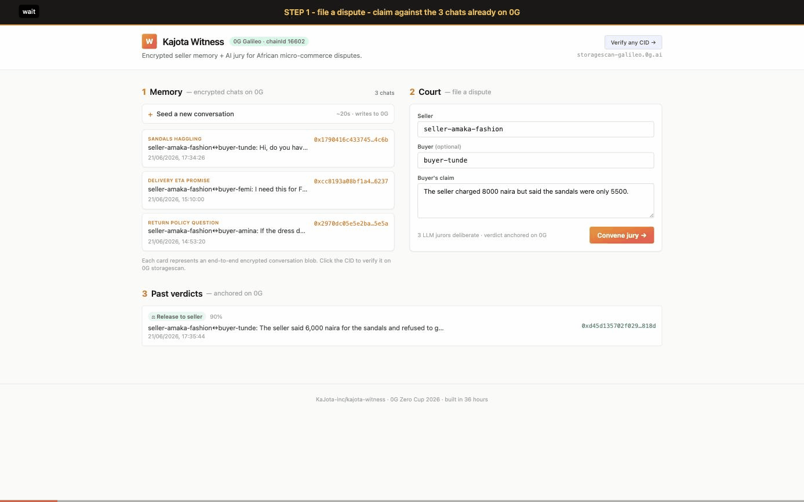
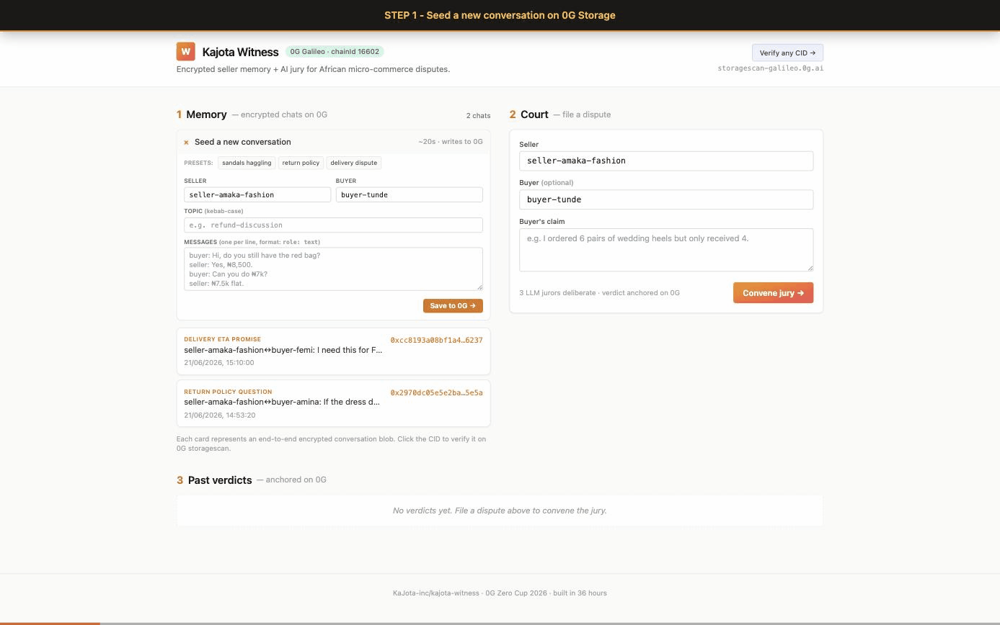
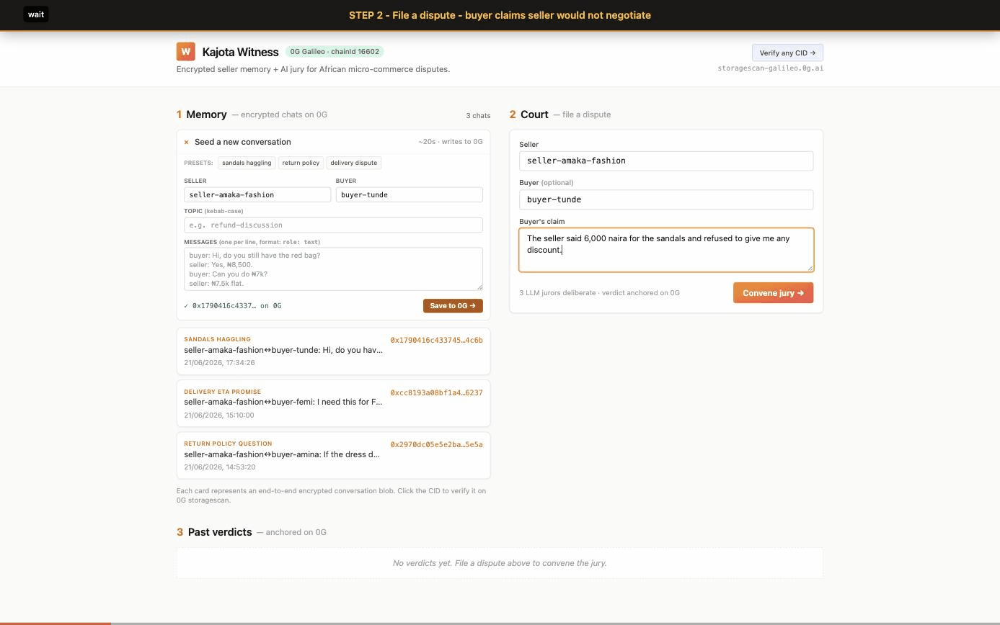
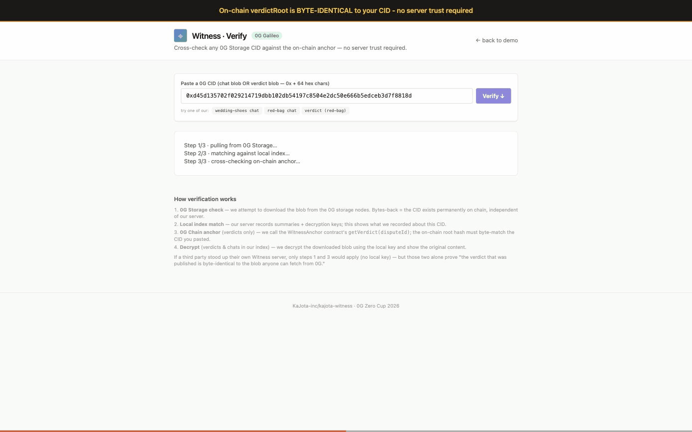

# Kajota Witness

**Encrypted seller memory + AI jury for African micro-commerce disputes — all on 0G Galileo.**

> 🌐 **Live demo:** https://kajota-hub.onrender.com/witness · [`/ui`](https://kajota-hub.onrender.com/witness/ui) · [`/verify`](https://kajota-hub.onrender.com/witness/verify)
> 📜 **Anchor contract:** [`0x2f1D3a88…cEC94`](https://chainscan-galileo.0g.ai/address/0x2f1D3a881cfbeA01Cf55f3cAd125aA32Bf8cEC94) on 0G Galileo
> ⌖ **Try /verify yourself:** paste `0xa9183d1ac0e9558fbac8501ce6034383122d36b4955259cf14d02448c092e5fb` into the live `/verify` page — all 4 cross-checks go green including `matchesStorageCid=true`



🎬 **Full 84-second walkthrough (recommended):** [`docs/demo/witness-demo-walkthrough.mp4`](docs/demo/witness-demo-walkthrough.mp4) (848 KB)
&nbsp;&nbsp;&nbsp;&nbsp;Title → 3 context cards (problem · arch · scenario) → STEP 1 SEED (emerald) → STEP 2 DISPUTE (amber) → STEP 3 VERIFY (indigo) → outro
&nbsp;&nbsp;&nbsp;&nbsp;Scenario: buyer asks for a graduation dress with Thursday delivery promise → dress arrives Saturday → jury rules `refund_buyer` 80%

Other cuts: [`witness-demo-steps.mp4`](docs/demo/witness-demo-steps.mp4) (54s, no context cards) · [`witness-demo.mp4`](docs/demo/witness-demo.mp4) (30s, fast)

<details>
<summary>Per-beat GIFs + how the MP4 is built</summary>

| Beat | GIF |
|---|---|
| Seed a new chat live on 0G |  |
| File dispute → jury deliberates → verdict on both 0G surfaces |  |
| Paste verdict CID into `/verify` → 4-way trustless cross-check |  |

Rebuild the MP4 (requires `ffmpeg` + `python3 -m pip install Pillow`):

```sh
cd docs/demo
mkdir -p _build && python3 build_cards.py _build
ffmpeg -y -loop 1 -t 3 -i _build/00-title.png -vf "scale=trunc(iw/2)*2:trunc(ih/2)*2" -r 10 -c:v libx264 -pix_fmt yuv420p _build/00.mp4
for g in witness-1-seed witness-2-dispute witness-3-verify-greens; do
  ffmpeg -y -i ${g}.gif -vf "scale=trunc(iw/2)*2:trunc(ih/2)*2" -r 10 -c:v libx264 -pix_fmt yuv420p _build/${g}.mp4
done
ffmpeg -y -loop 1 -t 5 -i _build/99-outro.png -vf "scale=trunc(iw/2)*2:trunc(ih/2)*2" -r 10 -c:v libx264 -pix_fmt yuv420p _build/99.mp4
printf "file '00.mp4'\nfile 'witness-1-seed.mp4'\nfile 'witness-2-dispute.mp4'\nfile 'witness-3-verify-greens.mp4'\nfile '99.mp4'\n" > _build/list.txt
ffmpeg -y -f concat -safe 0 -i _build/list.txt -c copy witness-demo.mp4
```

</details>

A standalone Fastify service that gives Kajota Coach (a sales-assistant agent for African sellers) cross-session memory that the seller actually owns, and an AI jury that pulls those exact conversations from 0G Storage as evidence when a Mesh escrow dispute fires.

Built for [0G Zero Cup 2026 — Round 1](https://0g.ai/arena/zero-cup).

---

## Demo loop

```
seed 3 conversations → file a dispute → jury deliberates → verdict on chain
                                                              │
                                                              ▼
                                             https://storagescan-galileo.0g.ai/tx/<cid>
```

A buyer claims they ordered 6 wedding heels but only got 4. The system:

1. **Pulls evidence** — embedding search over the seller's prior chats; top‑K decrypted from 0G.
2. **Convenes a jury** — three LLM jurors (prosecutor / defender / neutral) argue in parallel, then a judge model issues a ruling.
3. **Writes the verdict** — encrypted, content-addressed, anchored on 0G with its own root hash.

Total time per dispute: **~22 seconds** (5.8s evidence + 1.6s jury + 14.9s verdict-write). Cost: **$0** (Groq free tier + 0G testnet).

---

## Why 0G actually does work (per Zero Cup rules)

> *"0G has to do real work in your app. If it runs the same without it, that's a bolt-on and it doesn't qualify."*

Witness has **no fallback storage layer**. Conversations have nowhere to live but 0G. Verdicts have nowhere to anchor but 0G. The seller's "I own my data" promise resolves to a 0G CID — there is no Postgres mirror to swap in, no S3 hedge, no IPFS fallback.

| 0G surface | Used for | Removing it |
|---|---|---|
| 0G Storage (`@0gfoundation/0g-storage-ts-sdk` v1.2.10) | Encrypted chat blobs + verdict blobs, content-addressed | App can't store memory or verdicts — system is dead |
| 0G Galileo chain (chainId 16602) — storage txs | Settlement layer for storage uploads | No CID issuance |
| 0G Galileo chain — `WitnessAnchor` contract | Public commitment of each verdict's root hash + ruling + confidence + dispute pseudonym | No tamper-evident public record; verdicts are "trust me" |

The `WitnessAnchor` contract is deployed at [`0x2f1D3a881cfbeA01Cf55f3cAd125aA32Bf8cEC94`](https://chainscan-galileo.0g.ai/address/0x2f1D3a881cfbeA01Cf55f3cAd125aA32Bf8cEC94) on 0G Galileo. Every `/dispute` call: encrypts the verdict → uploads to 0G Storage → anchors `(disputeId, verdictRoot, ruling, confidenceBps)` on chain. The on-chain `verdictRoot` is byte-identical to the 0G Storage CID, so anyone can cross-reference one against the other without trusting our server.

---

## Architecture

```
┌─────────────────┐    POST /memory     ┌─────────────────┐
│  Kajota Coach   │ ─────────────────►  │   Witness API   │
│  (demo client)  │   ChatBlob          │   (Fastify)     │
└─────────────────┘                     └────────┬────────┘
                                                 │
                              encrypt (AES-GCM)  │  embed (all-MiniLM-L6-v2)
                                                 ▼
                                        ┌─────────────────┐
                                        │  0G Storage     │  ← root hash returned
                                        │   (Galileo)     │  ← indexed locally
                                        └─────────────────┘
                                                 │
                                                 │ POST /dispute fires
                                                 ▼
┌──────────────────┐  evidence (decrypted)  ┌────────────────────┐
│  3-LLM jury      │ ◄──────────────────────│  Top-K retrieval   │
│  (Groq /         │  ────────────────────► │  by cosine sim     │
│   llama-3.3-70b) │  verdict synthesis     └────────────────────┘
└────────┬─────────┘
         │ encrypt → upload
         ▼
┌─────────────────┐
│  0G Storage     │  ← verdict root hash anchored
│  (verdict blob) │  ← evidence CIDs cited inside
└─────────────────┘
```

---

## Stack

| Layer | Choice | Why |
|---|---|---|
| Runtime | Node 22 + TypeScript | 0G SDK is TS-only |
| Server | Fastify 5 | Smallest competent server |
| 0G | `@0gfoundation/0g-storage-ts-sdk` | Official, indexed via Galileo Turbo |
| Crypto | `crypto` (Node built-in) | AES-256-GCM envelope |
| Embeddings | `@xenova/transformers` (all-MiniLM-L6-v2, 384 dims) | Runs in-process; no external embed API |
| Vector index | JSON file + cosine top-K | Hackathon scale; trivially replaceable |
| LLM | Groq `llama-3.3-70b-versatile` (OpenAI-compatible API) | ~1.5s for 4 calls; free tier |
| UI | Static HTML + Tailwind CDN + vanilla JS | No build step; 1 file |

---

## Quick start

```sh
git clone https://github.com/KaJota-inc/kajota-witness.git
cd kajota-witness
npm install
cp .env.example .env
# Edit .env: WITNESS_DEPLOYER_PK + GROQ_API_KEY
```

`.env` needs:

```ini
# 0G Galileo testnet
ZG_RPC_URL=https://evmrpc-testnet.0g.ai
ZG_INDEXER_URL=https://indexer-storage-testnet-turbo.0g.ai

# Wallet with testnet 0G — drip at https://faucet.0g.ai (0.1 0G/day)
WITNESS_DEPLOYER_PK=0x...

# Free tier at https://console.groq.com/keys
GROQ_API_KEY=gsk_...

PORT=4022
```

Then:

```sh
npm run hello                      # round-trip a blob through 0G (de-risk SDK)
npx tsx src/probe-llm.ts           # 1-call Groq ping (de-risk LLM)
npx tsx scripts/deploy-anchor.ts   # deploy WitnessAnchor to 0G Galileo (writes WITNESS_ANCHOR_ADDRESS to .env)
npx tsx src/test-memory.ts         # seed 3 chats + run 3 retrieval queries (pre-warms ~80MB embedding model — first run is slow, subsequent runs hit .cache/)
npx tsx src/test-jury.ts           # full 3-dispute jury smoke test
npm run start                      # boot Fastify server
# open http://localhost:4022/ui
```

> **Tip:** Run `test-memory.ts` once after cloning. It downloads the `@xenova/transformers` model into `.cache/transformers/` (~80MB) so the first `/dispute` call on a fresh boot doesn't hang for 30s pulling the model.

---

## API

| Route | Body / Query | Returns |
|---|---|---|
| `GET /` | — | Service banner + route list |
| `GET /health` | — | `{ok, ts}` |
| `GET /ui` | — | Static HTML demo page (memory + dispute + verdict) |
| `GET /verify` | — | Static HTML verify page (paste any CID → 4 cross-checks) |
| `POST /memory` | `ChatBlob` | `WriteResult` — `{cid, txHash, storageScanUrl, chainScanUrl, summary}` |
| `GET /memory` | `?kind=chat\|verdict&sellerId=...` | `{entries: EntrySummary[]}` (sorted desc by ts) |
| `POST /evidence/query` | `{query, sellerId?, k?}` | `{query, count, hits[]}` — top-K with decrypted blobs |
| `POST /dispute` | `{sellerId, buyerId?, claim, evidenceQuery?, k?}` | `{verdict, evidence, onChain, timings}` |
| `GET /verify/:cid` | — | 4 cross-checks — `{storage, local, chain, decrypted}` with `chain.matchesStorageCid` boolean |

---

## File map

```
contracts/
├── WitnessAnchor.sol       # Anchor verdict (disputeId, verdictRoot, ruling, confidence) on 0G Galileo
└── WitnessAnchor.abi.json  # Generated by scripts/deploy-anchor.ts

scripts/
└── deploy-anchor.ts        # Compile (solc-js) + deploy via ethers — no Hardhat

src/
├── hello.ts                # SDK round-trip de-risk
├── probe-llm.ts            # Groq auth probe
├── server.ts               # Fastify routes
├── test-memory.ts          # 3-chat seed + retrieval smoke test
├── test-jury.ts            # 3-dispute end-to-end smoke test
├── lib/
│   ├── anchor.ts           # WitnessAnchor contract client (disputeIdOf, anchorVerdict)
│   ├── crypto.ts           # AES-256-GCM envelope (newKey/encrypt/decrypt/pack/unpack)
│   ├── embed.ts            # @xenova/transformers wrapper
│   ├── index-store.ts      # JSON file-backed embedding index
│   ├── jury.ts             # 3-juror + judge deliberation pipeline
│   ├── memory.ts           # MemoryService: writeChat / queryEvidence / writeVerdict / listEntries
│   └── og.ts               # 0G SDK wrapper: uploadBytes / downloadBytes
└── ui/
    └── index.html          # Single-page demo UI
```

---

## Companion Coach integration

The companion patch in [`KaJota-inc/kajota-coach@feat/witness-memory-integration`](https://github.com/KaJota-inc/kajota-coach/tree/feat/witness-memory-integration) wires the Coach FastAPI server to mirror every conversation turn into Witness. Fire-and-forget POST to `/memory` after each turn; non-blocking; soft-fail; opt-in via `WITNESS_URL` env var. End-to-end verified with the included smoke script. See [Coach agent README](https://github.com/KaJota-inc/kajota-coach/blob/feat/witness-memory-integration/agent/README.md) for the full env + smoke recipe.

## What's not in scope (yet)

- **Mesh escrow on-chain release** — the WitnessAnchor contract records verdicts on 0G Chain; the natural next step is wiring those records to actually call `releaseToSeller()` / `refundToBuyer()` on the existing Mesh escrow contracts on Mantle Sepolia. Architecturally clean, deferred for time.
- **Hybrid retrieval** — small MiniLM model + short chats sometimes misses on lexical edge cases (e.g. "shipping" vs "delivered"). Top-K=3 mitigates for the jury, but a BM25 + embedding hybrid is the proper fix.

---

## License

MIT.

---

## Repo conventions

Built start-to-finish during the Zero Cup tournament window — no pre-existing code. Submitted Mon Jun 22, 2026 to https://0g.ai/arena/zero-cup.

Co-author trail and milestone-by-milestone progress are in the commit history.
